# Loss-Weighting Comparison

Student metrics before and after applying tuned KD loss weights. The
**weightless** sweep ran every loss term at weight 1.0; the **weighted** sweep
applied ce=`1`, logit=`1.3`, hidden=`2.1`, attn=`400`, logit KD temperature `T`=`1`.
Deltas are `weighted - weightless`. Higher is better for F1 and accuracy;
**lower** is better for ECE. Single seed (42): read deltas as descriptive, not
causal.

## Best-Student Macro-F1 by Dataset

Best test macro-F1 over the 8 conditions on each side (each side's own argmax).

| Dataset | Weightless | Weighted | Delta |
|---|---:|---:|---:|
| `davidson` | 0.7582 | 0.7664 | +0.0082 |
| `dynahate` | 0.7405 | 0.7535 | +0.0129 |
| `hateval` | 0.5555 | 0.5676 | +0.0121 |
| `anli` | 0.4323 | 0.4312 | -0.0010 |
| `fever` | 0.8074 | 0.8074 | +0.0000 |
| `imdb` | 0.8519 | 0.8598 | +0.0079 |
| `tweet_eval-sentiment` | 0.6631 | 0.6631 | +0.0000 |
| `vardial` | 0.5702 | 0.6543 | +0.0840 |

## Best-Student F1 Chart

Best test macro-F1 over the 8 conditions per dataset, weightless vs weighted.

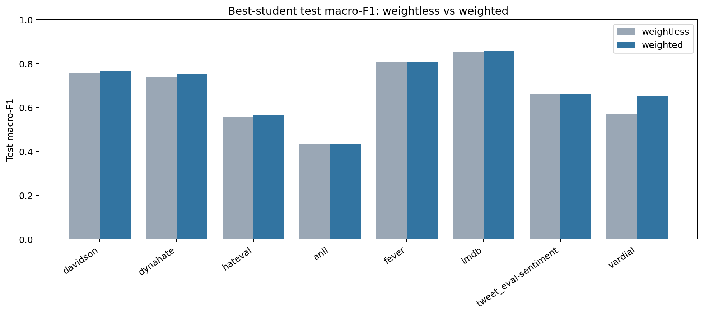

## Delta Heatmaps

Per metric, weighted minus weightless across datasets (rows) and conditions
(columns). Warm = weighted is higher, which is better for F1 and accuracy.
`vardial` is omitted as an outlier so the shared color scale stays readable.

### Δ macro f1

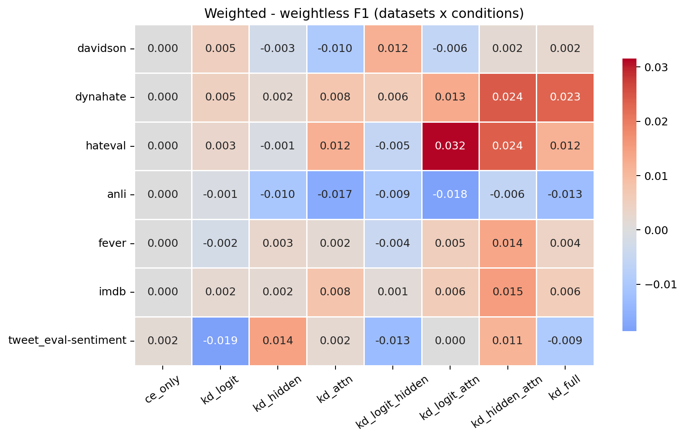

### Δ accuracy

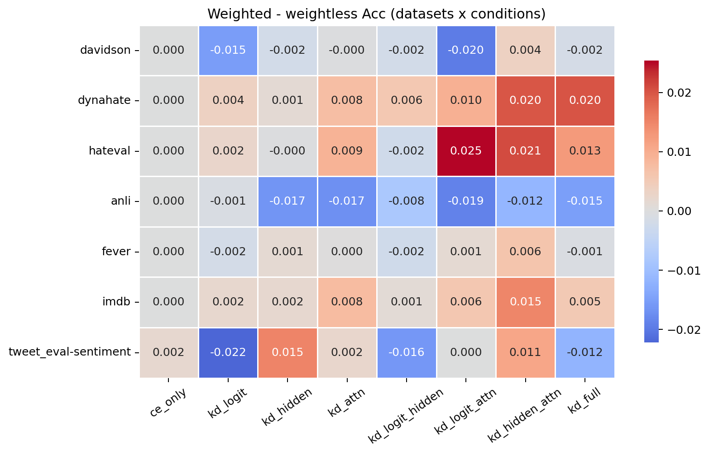

## `davidson`

| Condition | F1 wl | F1 w | ΔF1 | Acc wl | Acc w | ΔAcc | ECE wl | ECE w | ΔECE |
|---|---: | ---: | ---: | ---: | ---: | ---: | ---: | ---: | ---:|
| `ce_only` | 0.7313 | 0.7313 | +0.0000 | 0.9068 | 0.9068 | +0.0000 | 0.0153 | 0.0153 | +0.0000 |
| `kd_logit` | 0.7420 | 0.7472 | +0.0051 | 0.9088 | 0.8935 | -0.0153 | 0.0189 | 0.0184 | -0.0005 |
| `kd_hidden` | 0.7456 | 0.7427 | -0.0028 | 0.9109 | 0.9088 | -0.0020 | 0.0116 | 0.0104 | -0.0012 |
| `kd_attn` | 0.7561 | 0.7463 | -0.0097 | 0.9121 | 0.9117 | -0.0004 | 0.0123 | 0.0154 | +0.0031 |
| `kd_logit_hidden` | 0.7544 | 0.7664 | +0.0120 | 0.9149 | 0.9129 | -0.0020 | 0.0171 | 0.0191 | +0.0021 |
| `kd_logit_attn` | 0.7497 | 0.7440 | -0.0057 | 0.9129 | 0.8931 | -0.0198 | 0.0155 | 0.0191 | +0.0036 |
| `kd_hidden_attn` | 0.7484 | 0.7502 | +0.0018 | 0.9121 | 0.9157 | +0.0036 | 0.0095 | 0.0183 | +0.0089 |
| `kd_full` | 0.7582 | 0.7605 | +0.0023 | 0.9133 | 0.9117 | -0.0016 | 0.0170 | 0.0190 | +0.0019 |

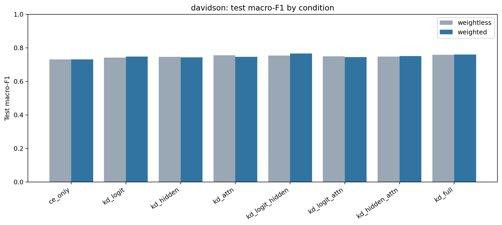

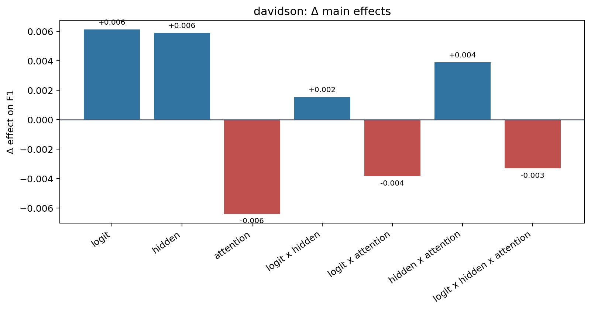

## `dynahate`

| Condition | F1 wl | F1 w | ΔF1 | Acc wl | Acc w | ΔAcc | ECE wl | ECE w | ΔECE |
|---|---: | ---: | ---: | ---: | ---: | ---: | ---: | ---: | ---:|
| `ce_only` | 0.7364 | 0.7364 | +0.0000 | 0.7432 | 0.7432 | +0.0000 | 0.0589 | 0.0589 | +0.0000 |
| `kd_logit` | 0.7377 | 0.7425 | +0.0048 | 0.7444 | 0.7481 | +0.0036 | 0.0589 | 0.0499 | -0.0089 |
| `kd_hidden` | 0.7007 | 0.7026 | +0.0018 | 0.7112 | 0.7124 | +0.0012 | 0.0785 | 0.0648 | -0.0138 |
| `kd_attn` | 0.7361 | 0.7437 | +0.0076 | 0.7451 | 0.7527 | +0.0075 | 0.0618 | 0.0623 | +0.0005 |
| `kd_logit_hidden` | 0.7022 | 0.7080 | +0.0058 | 0.7112 | 0.7167 | +0.0056 | 0.0494 | 0.0423 | -0.0070 |
| `kd_logit_attn` | 0.7405 | 0.7535 | +0.0129 | 0.7481 | 0.7578 | +0.0097 | 0.0592 | 0.0438 | -0.0154 |
| `kd_hidden_attn` | 0.7120 | 0.7363 | +0.0243 | 0.7228 | 0.7427 | +0.0199 | 0.0666 | 0.0571 | -0.0095 |
| `kd_full` | 0.7223 | 0.7455 | +0.0232 | 0.7291 | 0.7493 | +0.0201 | 0.0386 | 0.0336 | -0.0050 |

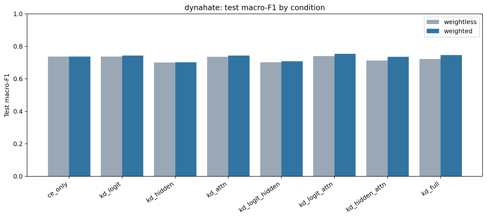

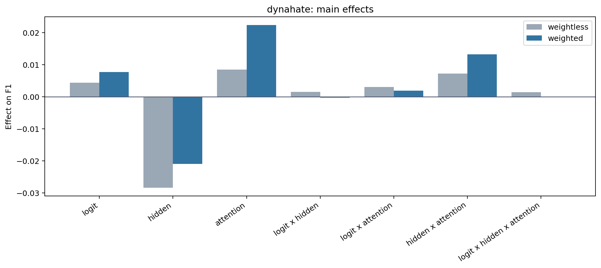

## `hateval`

| Condition | F1 wl | F1 w | ΔF1 | Acc wl | Acc w | ΔAcc | ECE wl | ECE w | ΔECE |
|---|---: | ---: | ---: | ---: | ---: | ---: | ---: | ---: | ---:|
| `ce_only` | 0.5436 | 0.5436 | +0.0000 | 0.5541 | 0.5541 | +0.0000 | 0.2961 | 0.2961 | +0.0000 |
| `kd_logit` | 0.5512 | 0.5542 | +0.0030 | 0.5650 | 0.5674 | +0.0024 | 0.2993 | 0.2975 | -0.0018 |
| `kd_hidden` | 0.5377 | 0.5365 | -0.0012 | 0.5508 | 0.5505 | -0.0002 | 0.2733 | 0.2773 | +0.0040 |
| `kd_attn` | 0.5555 | 0.5676 | +0.0121 | 0.5683 | 0.5775 | +0.0092 | 0.2971 | 0.2819 | -0.0151 |
| `kd_logit_hidden` | 0.5498 | 0.5444 | -0.0054 | 0.5608 | 0.5584 | -0.0024 | 0.2822 | 0.3021 | +0.0199 |
| `kd_logit_attn` | 0.5315 | 0.5631 | +0.0316 | 0.5490 | 0.5744 | +0.0254 | 0.3094 | 0.2841 | -0.0253 |
| `kd_hidden_attn` | 0.5352 | 0.5590 | +0.0239 | 0.5490 | 0.5698 | +0.0208 | 0.2799 | 0.2809 | +0.0009 |
| `kd_full` | 0.5474 | 0.5590 | +0.0116 | 0.5591 | 0.5718 | +0.0127 | 0.2877 | 0.2839 | -0.0038 |

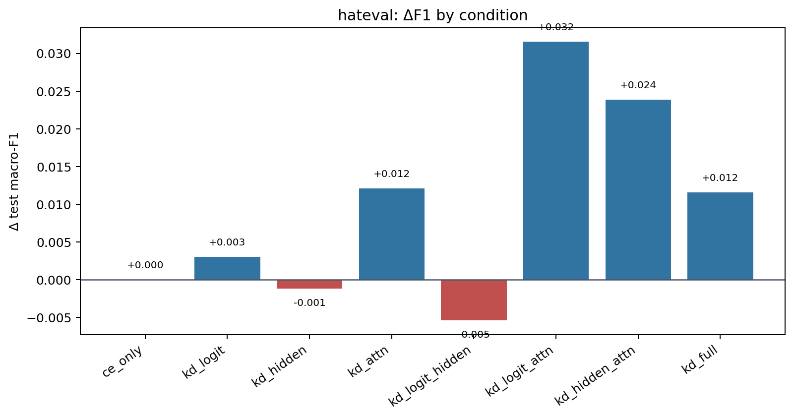

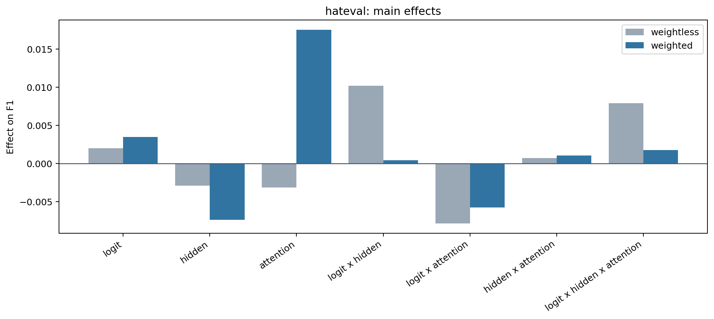

## `anli`

| Condition | F1 wl | F1 w | ΔF1 | Acc wl | Acc w | ΔAcc | ECE wl | ECE w | ΔECE |
|---|---: | ---: | ---: | ---: | ---: | ---: | ---: | ---: | ---:|
| `ce_only` | 0.4240 | 0.4240 | +0.0000 | 0.4316 | 0.4316 | +0.0000 | 0.3249 | 0.3249 | +0.0000 |
| `kd_logit` | 0.4323 | 0.4312 | -0.0010 | 0.4403 | 0.4394 | -0.0009 | 0.3196 | 0.3223 | +0.0027 |
| `kd_hidden` | 0.4206 | 0.4103 | -0.0103 | 0.4328 | 0.4163 | -0.0166 | 0.3224 | 0.2758 | -0.0466 |
| `kd_attn` | 0.4230 | 0.4065 | -0.0166 | 0.4309 | 0.4138 | -0.0172 | 0.3239 | 0.2804 | -0.0435 |
| `kd_logit_hidden` | 0.4299 | 0.4206 | -0.0093 | 0.4406 | 0.4325 | -0.0081 | 0.3235 | 0.3329 | +0.0094 |
| `kd_logit_attn` | 0.4317 | 0.4134 | -0.0182 | 0.4400 | 0.4213 | -0.0187 | 0.3221 | 0.2809 | -0.0412 |
| `kd_hidden_attn` | 0.4195 | 0.4135 | -0.0060 | 0.4316 | 0.4200 | -0.0116 | 0.3248 | 0.2701 | -0.0547 |
| `kd_full` | 0.4286 | 0.4156 | -0.0130 | 0.4381 | 0.4231 | -0.0150 | 0.3243 | 0.2723 | -0.0520 |

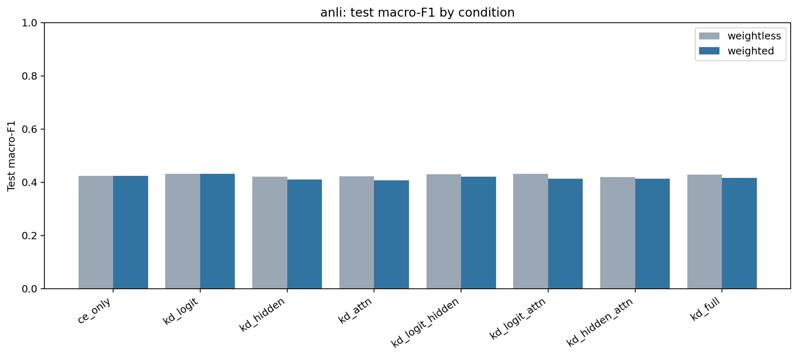

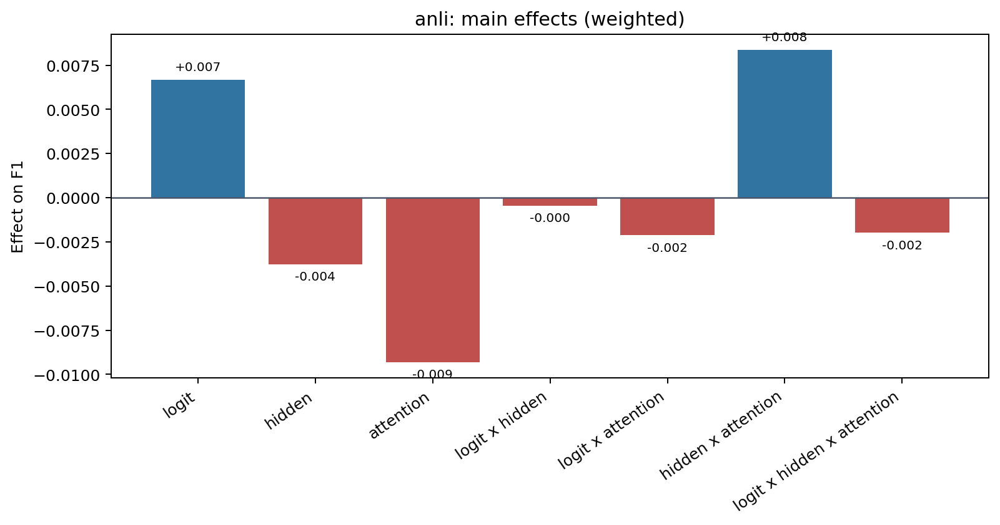

## `fever`

| Condition | F1 wl | F1 w | ΔF1 | Acc wl | Acc w | ΔAcc | ECE wl | ECE w | ΔECE |
|---|---: | ---: | ---: | ---: | ---: | ---: | ---: | ---: | ---:|
| `ce_only` | 0.8074 | 0.8074 | +0.0000 | 0.8630 | 0.8630 | +0.0000 | 0.0202 | 0.0202 | +0.0000 |
| `kd_logit` | 0.8035 | 0.8012 | -0.0023 | 0.8620 | 0.8602 | -0.0018 | 0.0264 | 0.0271 | +0.0007 |
| `kd_hidden` | 0.7875 | 0.7903 | +0.0028 | 0.8510 | 0.8524 | +0.0014 | 0.0327 | 0.0265 | -0.0062 |
| `kd_attn` | 0.8038 | 0.8055 | +0.0017 | 0.8606 | 0.8608 | +0.0002 | 0.0230 | 0.0222 | -0.0008 |
| `kd_logit_hidden` | 0.7975 | 0.7932 | -0.0044 | 0.8580 | 0.8556 | -0.0024 | 0.0279 | 0.0307 | +0.0028 |
| `kd_logit_attn` | 0.8014 | 0.8068 | +0.0055 | 0.8602 | 0.8616 | +0.0014 | 0.0272 | 0.0241 | -0.0032 |
| `kd_hidden_attn` | 0.7864 | 0.8000 | +0.0137 | 0.8508 | 0.8572 | +0.0064 | 0.0333 | 0.0273 | -0.0060 |
| `kd_full` | 0.7981 | 0.8021 | +0.0040 | 0.8584 | 0.8576 | -0.0008 | 0.0289 | 0.0200 | -0.0089 |

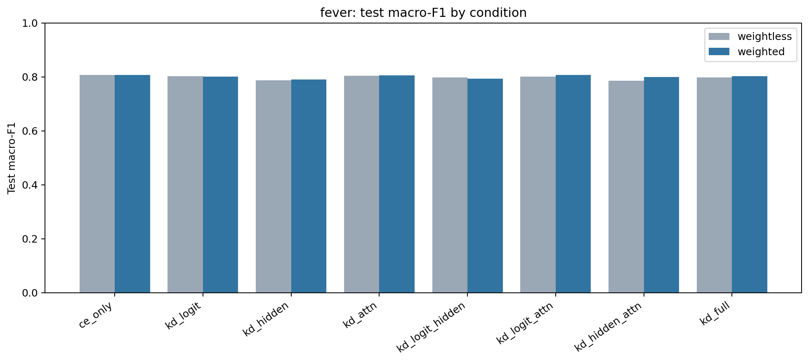

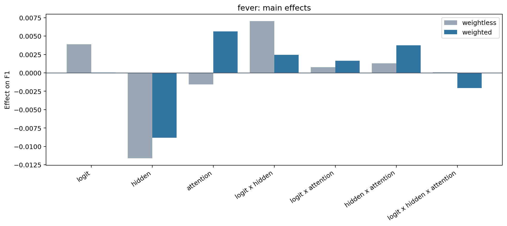

## `imdb`

| Condition | F1 wl | F1 w | ΔF1 | Acc wl | Acc w | ΔAcc | ECE wl | ECE w | ΔECE |
|---|---: | ---: | ---: | ---: | ---: | ---: | ---: | ---: | ---:|
| `ce_only` | 0.8502 | 0.8502 | +0.0000 | 0.8505 | 0.8505 | +0.0000 | 0.0397 | 0.0397 | +0.0000 |
| `kd_logit` | 0.8508 | 0.8529 | +0.0021 | 0.8511 | 0.8531 | +0.0020 | 0.0402 | 0.0390 | -0.0012 |
| `kd_hidden` | 0.8384 | 0.8403 | +0.0018 | 0.8388 | 0.8408 | +0.0019 | 0.0343 | 0.0299 | -0.0044 |
| `kd_attn` | 0.8519 | 0.8598 | +0.0079 | 0.8522 | 0.8599 | +0.0077 | 0.0381 | 0.0426 | +0.0045 |
| `kd_logit_hidden` | 0.8507 | 0.8518 | +0.0011 | 0.8508 | 0.8519 | +0.0010 | 0.0375 | 0.0375 | -0.0000 |
| `kd_logit_attn` | 0.8506 | 0.8565 | +0.0059 | 0.8509 | 0.8566 | +0.0057 | 0.0405 | 0.0408 | +0.0003 |
| `kd_hidden_attn` | 0.8387 | 0.8539 | +0.0152 | 0.8391 | 0.8540 | +0.0149 | 0.0347 | 0.0353 | +0.0006 |
| `kd_full` | 0.8505 | 0.8561 | +0.0057 | 0.8507 | 0.8562 | +0.0055 | 0.0383 | 0.0388 | +0.0006 |

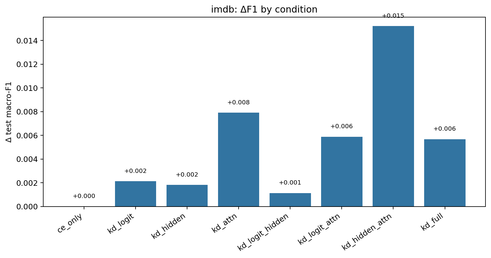

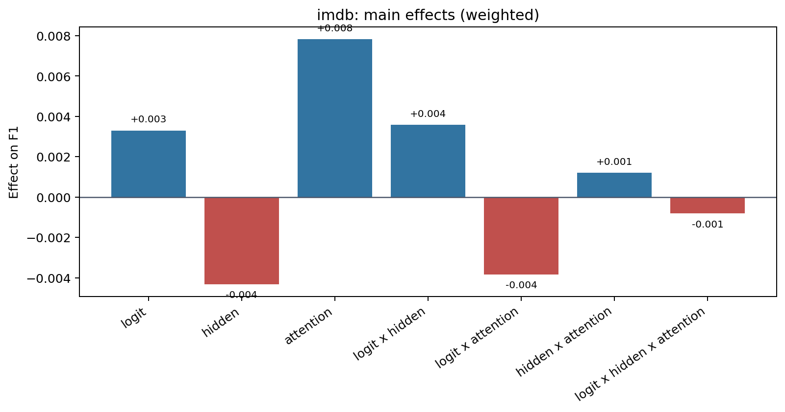

## `tweet_eval-sentiment`

| Condition | F1 wl | F1 w | ΔF1 | Acc wl | Acc w | ΔAcc | ECE wl | ECE w | ΔECE |
|---|---: | ---: | ---: | ---: | ---: | ---: | ---: | ---: | ---:|
| `ce_only` | 0.6592 | 0.6607 | +0.0016 | 0.6576 | 0.6594 | +0.0018 | 0.0789 | 0.0855 | +0.0066 |
| `kd_logit` | 0.6631 | 0.6444 | -0.0187 | 0.6653 | 0.6431 | -0.0222 | 0.0506 | 0.1147 | +0.0641 |
| `kd_hidden` | 0.6475 | 0.6619 | +0.0144 | 0.6468 | 0.6618 | +0.0151 | 0.0895 | 0.0801 | -0.0094 |
| `kd_attn` | 0.6609 | 0.6631 | +0.0023 | 0.6596 | 0.6619 | +0.0023 | 0.0741 | 0.0723 | -0.0019 |
| `kd_logit_hidden` | 0.6521 | 0.6389 | -0.0132 | 0.6536 | 0.6377 | -0.0160 | 0.0539 | 0.1242 | +0.0703 |
| `kd_logit_attn` | 0.6433 | 0.6433 | +0.0000 | 0.6419 | 0.6419 | +0.0000 | 0.1077 | 0.1077 | +0.0000 |
| `kd_hidden_attn` | 0.6478 | 0.6591 | +0.0112 | 0.6470 | 0.6579 | +0.0109 | 0.0929 | 0.0868 | -0.0060 |
| `kd_full` | 0.6552 | 0.6459 | -0.0093 | 0.6565 | 0.6446 | -0.0120 | 0.0508 | 0.1057 | +0.0549 |

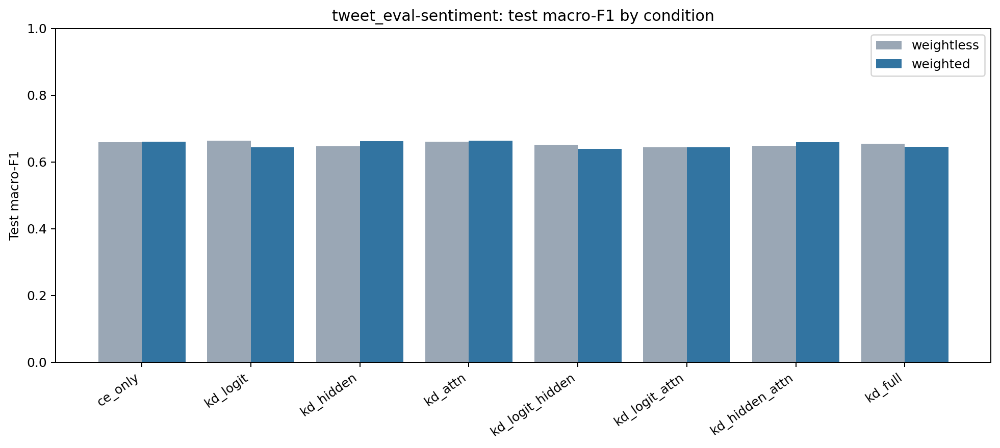

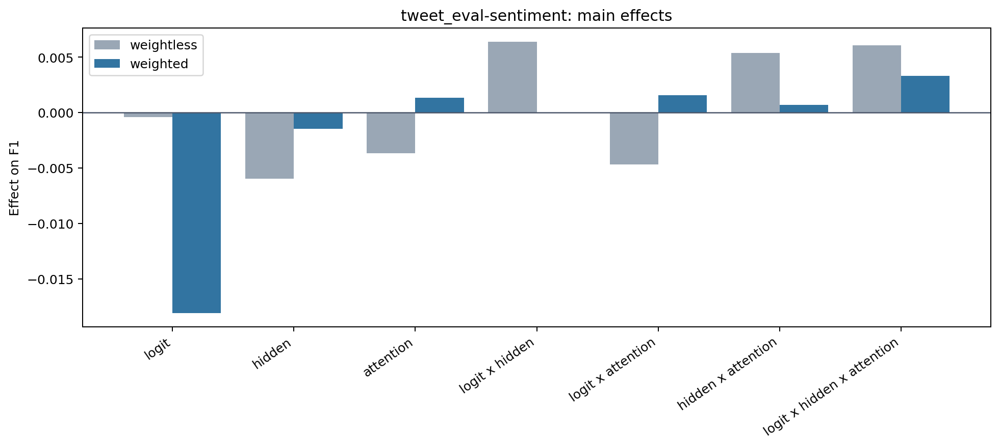

## `vardial`

| Condition | F1 wl | F1 w | ΔF1 | Acc wl | Acc w | ΔAcc | ECE wl | ECE w | ΔECE |
|---|---: | ---: | ---: | ---: | ---: | ---: | ---: | ---: | ---:|
| `ce_only` | 0.5702 | 0.5702 | +0.0000 | 0.5726 | 0.5726 | +0.0000 | 0.0286 | 0.0286 | +0.0000 |
| `kd_logit` | 0.5433 | 0.5969 | +0.0536 | 0.5516 | 0.6000 | +0.0484 | 0.0394 | 0.0454 | +0.0060 |
| `kd_hidden` | 0.3944 | 0.3733 | -0.0212 | 0.4189 | 0.4126 | -0.0063 | 0.0496 | 0.0371 | -0.0125 |
| `kd_attn` | 0.5494 | 0.6330 | +0.0836 | 0.5579 | 0.6316 | +0.0737 | 0.0616 | 0.0786 | +0.0171 |
| `kd_logit_hidden` | 0.5544 | 0.4878 | -0.0666 | 0.5621 | 0.4947 | -0.0674 | 0.0403 | 0.0397 | -0.0006 |
| `kd_logit_attn` | 0.5670 | 0.6543 | +0.0873 | 0.5768 | 0.6526 | +0.0758 | 0.0698 | 0.0470 | -0.0228 |
| `kd_hidden_attn` | 0.3892 | 0.5176 | +0.1284 | 0.4210 | 0.5326 | +0.1116 | 0.0382 | 0.0391 | +0.0009 |
| `kd_full` | 0.5192 | 0.6136 | +0.0944 | 0.5326 | 0.6168 | +0.0842 | 0.0340 | 0.0558 | +0.0218 |

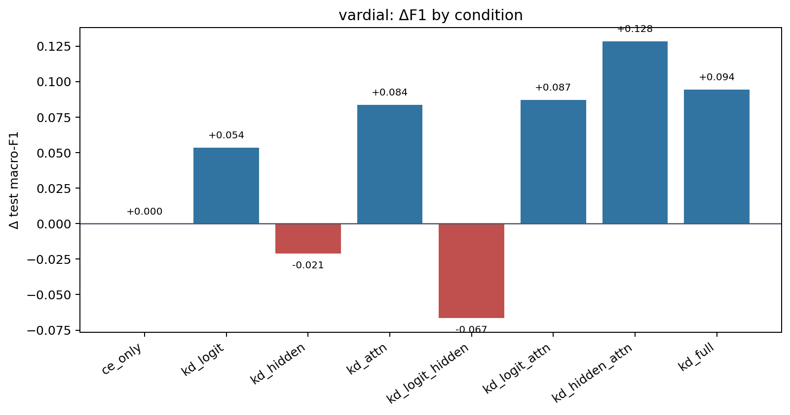

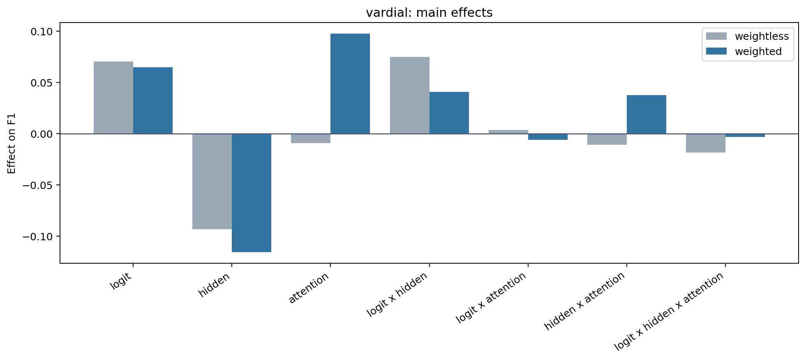
