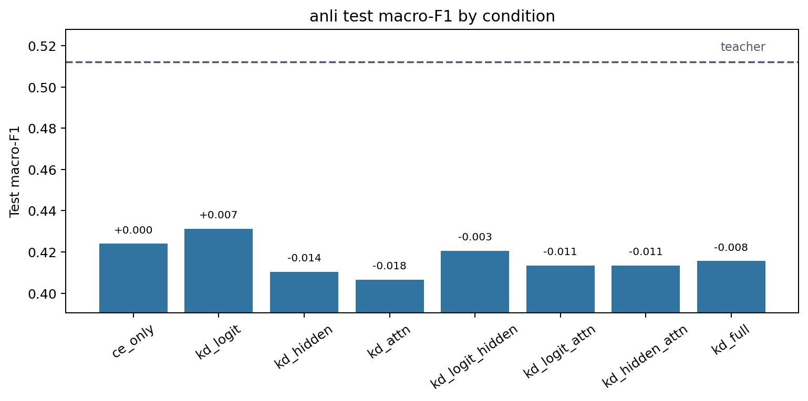
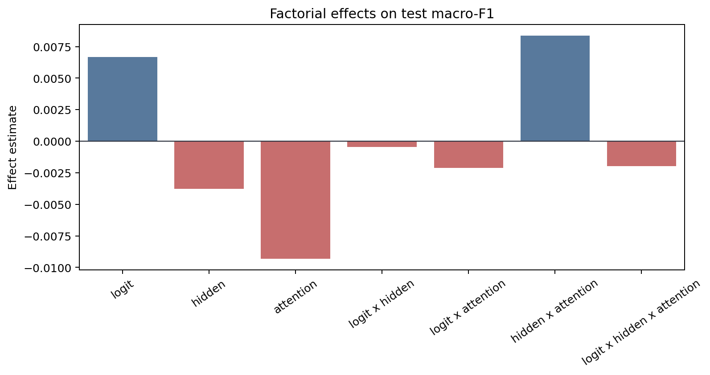
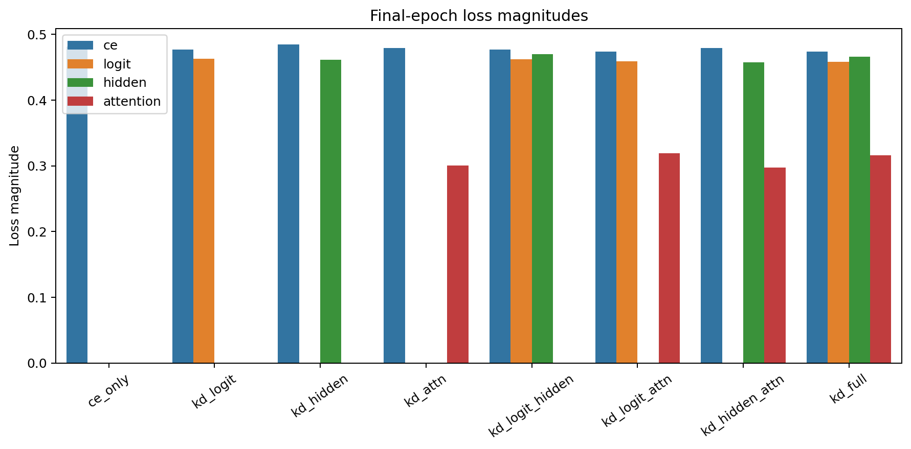
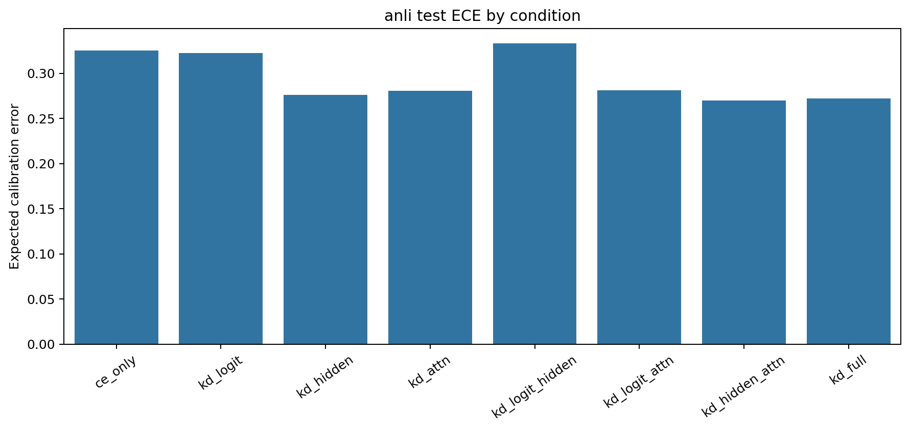

# Factorial Analysis Report

Dataset: `anli`

## Artifact Summary

- Teacher metadata: `results/metadata/anli/teacher/run_metadata.json`
- Student metadata: `results/metadata/anli/student/*/run_metadata.json`
- Report: `results/analysis/anli/REPORT.md`
- Figures: `figures/`

## Validity Checklist

| Check | Status | Detail |
|---|:---:|---|
| all 8 conditions present and valid | PASS | all 8 condition metadata files are present and valid |
| epochs completed | PASS | all runs completed configured epochs or documented early-stop |
| finite metrics/losses | PASS | all required metrics and active losses are finite |
| teacher forward sane | PASS | top1_agreement is present and above random for every KD condition |
| metric ranges | PASS | F1/accuracy/agreement/ECE values are within [0, 1] |
| artifacts written | PASS | 4 PNG figures and 1 markdown report written |

## Key Results

- Teacher test macro-F1: `0.5121`.
- Best student: `kd_logit` with test macro-F1 `0.4312`.
- CE-only student test macro-F1: `0.4240`.
- Student macro-F1 spread across conditions: `0.0248`.
- Mean final attention-loss magnitude: `0.30819`.

The best student is `kd_logit` (test macro-F1 `0.4312`), but with a single seed the factorial effects
below should be read as pipeline diagnostics and descriptive statistics, not
resolved causal estimates.

## Loss Weights

Global weights multiplying each active loss term:
`L_total = w_ce*L_CE + I_logit*w_logit*L_logit + I_hidden*w_hidden*L_hidden
+ I_attn*w_attn*L_attn`. Per-condition indicators `I` toggle terms on or off;
the weights themselves are identical across all conditions and datasets.

| Term | Weight |
|---|---:|
| CE | `1` |
| Logit | `1.3` |
| Hidden | `2.1` |
| Attention | `400` |

Logit KD temperature `T`: `1`.

## Student Ablation Table

Dataset: `anli`

Source files:
`results/metadata/anli/teacher/run_metadata.json` and
`results/metadata/anli/student/*/run_metadata.json`

Primary metric: test macro-F1. `Delta` is test macro-F1 relative to `ce_only`.
Rows are ordered by test macro-F1 descending.
Bold marks the best value in each metric column: higher is better for F1,
accuracy, and agreement; lower is better for ECE.

| Condition | Logit | Hidden | Attention | Test Macro-F1 | Delta | Test Acc. | Test ECE | Top-1 Agree |
|---|:---:|:---:|:---:|---:|---:|---:|---:|---:|
| `teacher` | N/A | N/A | N/A | **0.5121** | **+0.0882** | **0.5159** | 0.3267 | N/A |
| `kd_logit` | Y |  |  | 0.4312 | +0.0072 | 0.4394 | 0.3223 | 0.6613 |
| `ce_only` |  |  |  | 0.4240 | +0.0000 | 0.4316 | 0.3249 | 0.6534 |
| `kd_logit_hidden` | Y | Y |  | 0.4206 | -0.0034 | 0.4325 | 0.3329 | 0.6647 |
| `kd_full` | Y | Y | Y | 0.4156 | -0.0084 | 0.4231 | 0.2723 | 0.6644 |
| `kd_hidden_attn` |  | Y | Y | 0.4135 | -0.0105 | 0.4200 | **0.2701** | 0.6522 |
| `kd_logit_attn` | Y |  | Y | 0.4134 | -0.0106 | 0.4213 | 0.2809 | **0.6650** |
| `kd_hidden` |  | Y |  | 0.4103 | -0.0137 | 0.4163 | 0.2758 | 0.6550 |
| `kd_attn` |  |  | Y | 0.4065 | -0.0175 | 0.4138 | 0.2804 | 0.6519 |

Best student test macro-F1 is `kd_logit` at 0.4312, +0.0072 over `ce_only`.
The teacher reference is higher at 0.5121.

## Factorial Effects

Metric: `test_macro_f1`

Positive estimates mean the factor or interaction increases the metric under
standard +/-1 factorial coding. Magnitudes are informational for this
single-seed run.

| Effect | Kind | Estimate | Absolute |
|---|---:|---:|---:|
| `logit` | main | +0.00666 | 0.00666 |
| `hidden` | main | -0.00378 | 0.00378 |
| `attention` | main | -0.00930 | 0.00930 |
| `logit x hidden` | 2-way | -0.00045 | 0.00045 |
| `logit x attention` | 2-way | -0.00213 | 0.00213 |
| `hidden x attention` | 2-way | +0.00836 | 0.00836 |
| `logit x hidden x attention` | 3-way | -0.00199 | 0.00199 |

## Attention-Loss Caveat

Attention KD used post-softmax attention probabilities in this run. Its
final loss magnitude is near-inert compared with CE, logit, and hidden
losses, so the attention factor was only weakly applied. Fix this signal or
explicitly document the caveat before scaling the experiment.

## Figures

### Condition Bars

### Main Effects

### Loss Magnitudes

### Calibration

