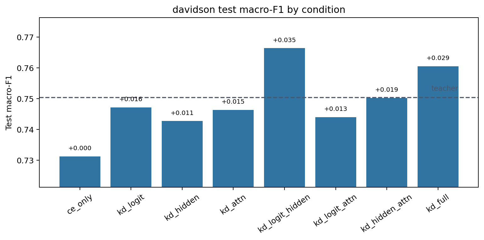
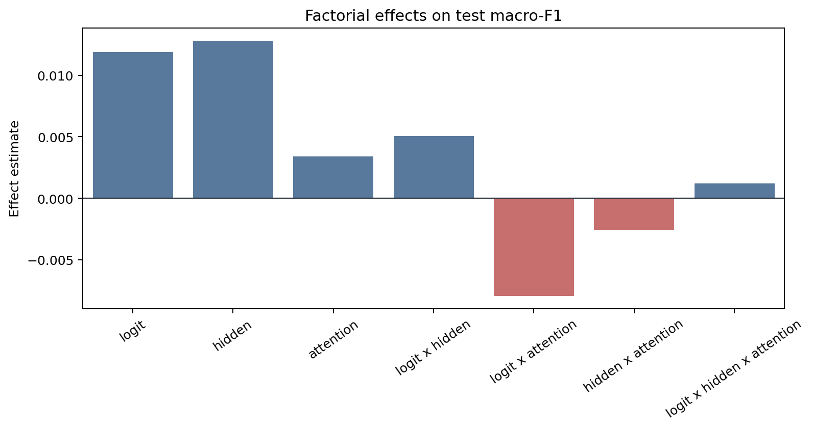
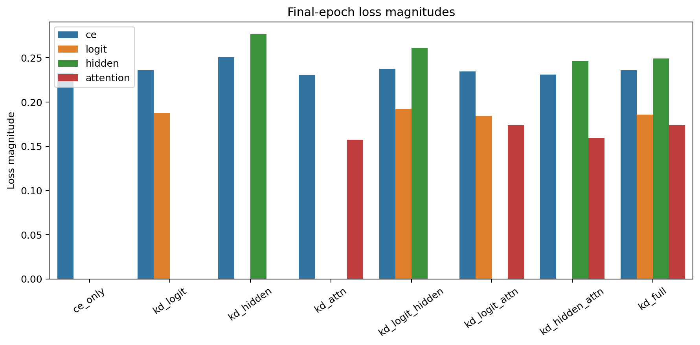
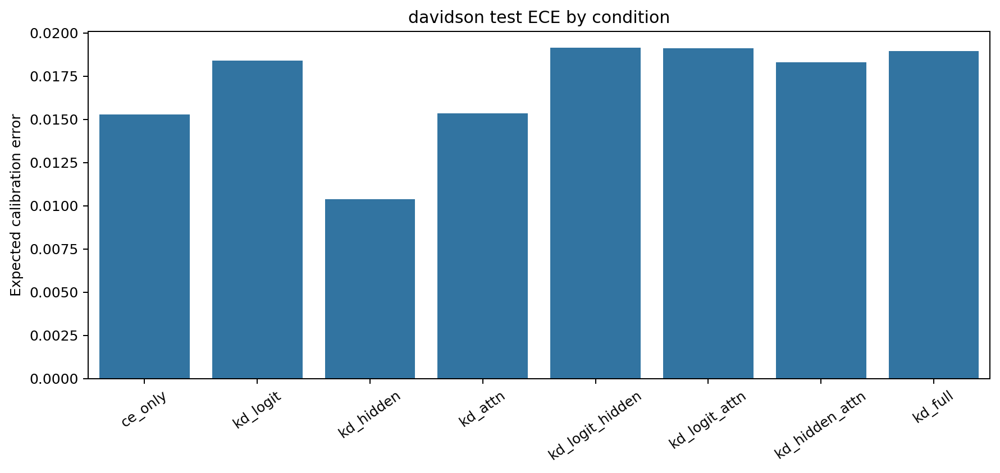

# Factorial Analysis Report

Dataset: `davidson`

## Artifact Summary

- Teacher metadata: `results/metadata/davidson/teacher/run_metadata.json`
- Student metadata: `results/metadata/davidson/student/*/run_metadata.json`
- Report: `results/analysis/davidson/REPORT.md`
- Figures: `figures/`

## Validity Checklist

| Check | Status | Detail |
|---|:---:|---|
| all 8 conditions present and valid | PASS | all 8 condition metadata files are present and valid |
| epochs completed | PASS | all runs completed configured epochs or documented early-stop |
| finite metrics/losses | PASS | all required metrics and active losses are finite |
| teacher forward sane | PASS | top1_agreement is present and above random for every KD condition |
| metric ranges | PASS | F1/accuracy/agreement/ECE values are within [0, 1] |
| artifacts written | PASS | 4 PNG figures and 1 markdown report written |

## Key Results

- Teacher test macro-F1: `0.7504`.
- Best student: `kd_logit_hidden` with test macro-F1 `0.7664`.
- CE-only student test macro-F1: `0.7313`.
- Student macro-F1 spread across conditions: `0.0351`.
- Mean final attention-loss magnitude: `0.16602`.

The best student is `kd_logit_hidden` (test macro-F1 `0.7664`), but with a single seed the factorial effects
below should be read as pipeline diagnostics and descriptive statistics, not
resolved causal estimates.

## Student Ablation Table

Dataset: `davidson`

Source files:
`results/metadata/davidson/teacher/run_metadata.json` and
`results/metadata/davidson/student/*/run_metadata.json`

Primary metric: test macro-F1. `Delta` is test macro-F1 relative to `ce_only`.
Rows are ordered by test macro-F1 descending.
Bold marks the best value in each metric column: higher is better for F1,
accuracy, and agreement; lower is better for ECE.

| Condition | Logit | Hidden | Attention | Test Macro-F1 | Delta | Test Acc. | Test ECE | Top-1 Agree |
|---|:---:|:---:|:---:|---:|---:|---:|---:|---:|
| `kd_logit_hidden` | Y | Y |  | **0.7664** | **+0.0351** | 0.9129 | 0.0191 | 0.9540 |
| `kd_full` | Y | Y | Y | 0.7605 | +0.0292 | 0.9117 | 0.0190 | **0.9552** |
| `teacher` | N/A | N/A | N/A | 0.7504 | +0.0192 | 0.9012 | 0.0300 | N/A |
| `kd_hidden_attn` |  | Y | Y | 0.7502 | +0.0190 | **0.9157** | 0.0183 | 0.9431 |
| `kd_logit` | Y |  |  | 0.7472 | +0.0159 | 0.8935 | 0.0184 | 0.9447 |
| `kd_attn` |  |  | Y | 0.7463 | +0.0151 | 0.9117 | 0.0154 | 0.9480 |
| `kd_logit_attn` | Y |  | Y | 0.7440 | +0.0128 | 0.8931 | 0.0191 | 0.9496 |
| `kd_hidden` |  | Y |  | 0.7427 | +0.0115 | 0.9088 | **0.0104** | 0.9387 |
| `ce_only` |  |  |  | 0.7313 | +0.0000 | 0.9068 | 0.0153 | 0.9427 |

Best student test macro-F1 is `kd_logit_hidden` at 0.7664, +0.0351 over `ce_only`.
The teacher reference is higher at 0.7504.

## Factorial Effects

Metric: `test_macro_f1`

Positive estimates mean the factor or interaction increases the metric under
standard +/-1 factorial coding. Magnitudes are informational for this
single-seed run.

| Effect | Kind | Estimate | Absolute |
|---|---:|---:|---:|
| `logit` | main | +0.01189 | 0.01189 |
| `hidden` | main | +0.01278 | 0.01278 |
| `attention` | main | +0.00339 | 0.00339 |
| `logit x hidden` | 2-way | +0.00508 | 0.00508 |
| `logit x attention` | 2-way | -0.00790 | 0.00790 |
| `hidden x attention` | 2-way | -0.00256 | 0.00256 |
| `logit x hidden x attention` | 3-way | +0.00120 | 0.00120 |

## Attention-Loss Caveat

Attention KD used post-softmax attention probabilities in this run. Its
final loss magnitude is near-inert compared with CE, logit, and hidden
losses, so the attention factor was only weakly applied. Fix this signal or
explicitly document the caveat before scaling the experiment.

## Figures

### Condition Bars

### Main Effects

### Loss Magnitudes

### Calibration

