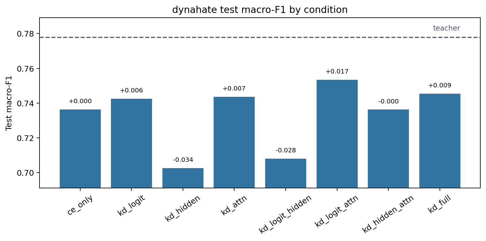
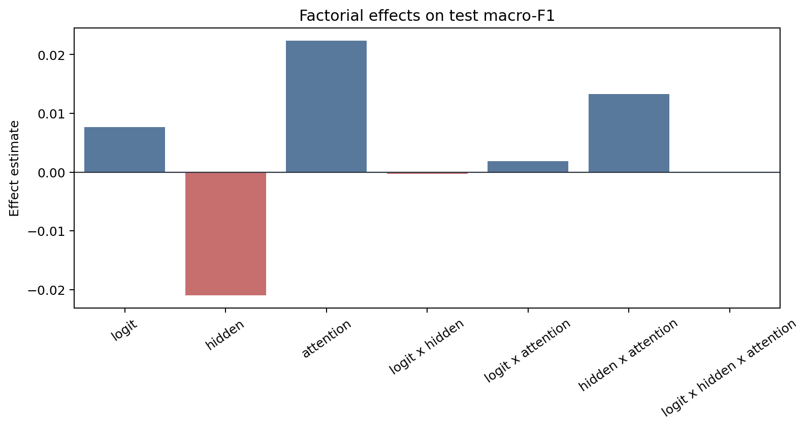
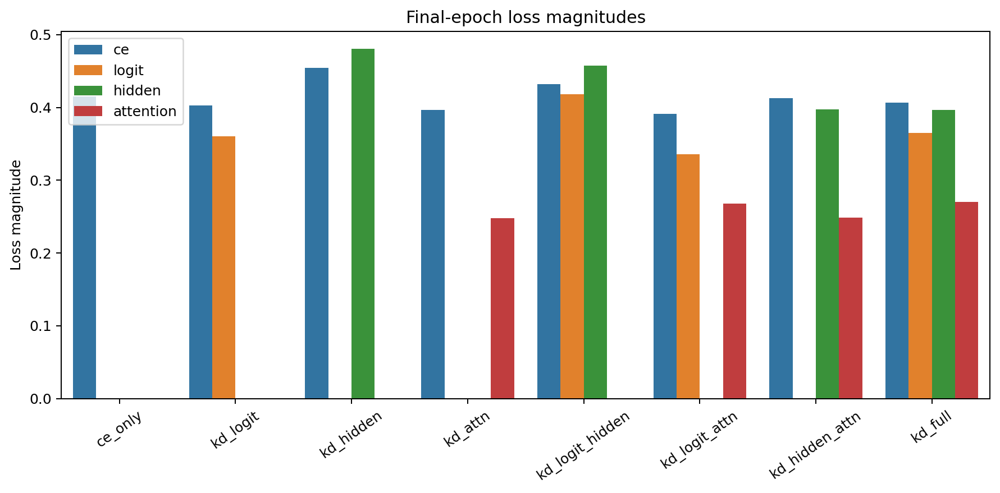
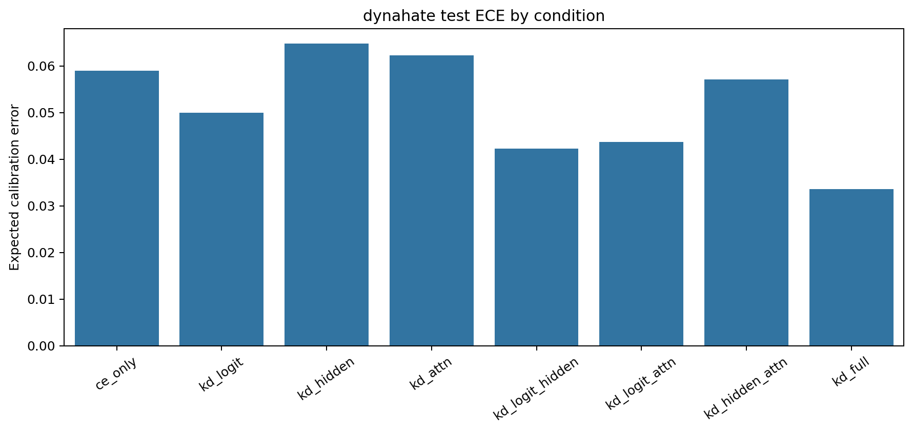

# Factorial Analysis Report

Dataset: `dynahate`

## Artifact Summary

- Teacher metadata: `results/metadata/dynahate/teacher/run_metadata.json`
- Student metadata: `results/metadata/dynahate/student/*/run_metadata.json`
- Report: `results/analysis/dynahate/REPORT.md`
- Figures: `figures/`

## Validity Checklist

| Check | Status | Detail |
|---|:---:|---|
| all 8 conditions present and valid | PASS | all 8 condition metadata files are present and valid |
| epochs completed | PASS | all runs completed configured epochs or documented early-stop |
| finite metrics/losses | PASS | all required metrics and active losses are finite |
| teacher forward sane | PASS | top1_agreement is present and above random for every KD condition |
| metric ranges | PASS | F1/accuracy/agreement/ECE values are within [0, 1] |
| artifacts written | PASS | 4 PNG figures and 1 markdown report written |

## Key Results

- Teacher test macro-F1: `0.7779`.
- Best student: `kd_logit_attn` with test macro-F1 `0.7535`.
- CE-only student test macro-F1: `0.7364`.
- Student macro-F1 spread across conditions: `0.0509`.
- Mean final attention-loss magnitude: `0.25863`.

The best student is `kd_logit_attn` (test macro-F1 `0.7535`), but with a single seed the factorial effects
below should be read as pipeline diagnostics and descriptive statistics, not
resolved causal estimates.

## Student Ablation Table

Dataset: `dynahate`

Source files:
`results/metadata/dynahate/teacher/run_metadata.json` and
`results/metadata/dynahate/student/*/run_metadata.json`

Primary metric: test macro-F1. `Delta` is test macro-F1 relative to `ce_only`.
Rows are ordered by test macro-F1 descending.
Bold marks the best value in each metric column: higher is better for F1,
accuracy, and agreement; lower is better for ECE.

| Condition | Logit | Hidden | Attention | Test Macro-F1 | Delta | Test Acc. | Test ECE | Top-1 Agree |
|---|:---:|:---:|:---:|---:|---:|---:|---:|---:|
| `teacher` | N/A | N/A | N/A | **0.7779** | **+0.0415** | **0.7811** | 0.0667 | N/A |
| `kd_logit_attn` | Y |  | Y | 0.7535 | +0.0171 | 0.7578 | 0.0438 | **0.8529** |
| `kd_full` | Y | Y | Y | 0.7455 | +0.0091 | 0.7493 | **0.0336** | 0.8439 |
| `kd_attn` |  |  | Y | 0.7437 | +0.0072 | 0.7527 | 0.0623 | 0.8430 |
| `kd_logit` | Y |  |  | 0.7425 | +0.0061 | 0.7481 | 0.0499 | 0.8388 |
| `ce_only` |  |  |  | 0.7364 | +0.0000 | 0.7432 | 0.0589 | 0.8306 |
| `kd_hidden_attn` |  | Y | Y | 0.7363 | -0.0001 | 0.7427 | 0.0571 | 0.8384 |
| `kd_logit_hidden` | Y | Y |  | 0.7080 | -0.0284 | 0.7167 | 0.0423 | 0.8104 |
| `kd_hidden` |  | Y |  | 0.7026 | -0.0339 | 0.7124 | 0.0648 | 0.8036 |

Best student test macro-F1 is `kd_logit_attn` at 0.7535, +0.0171 over `ce_only`.
The teacher reference is higher at 0.7779.

## Factorial Effects

Metric: `test_macro_f1`

Positive estimates mean the factor or interaction increases the metric under
standard +/-1 factorial coding. Magnitudes are informational for this
single-seed run.

| Effect | Kind | Estimate | Absolute |
|---|---:|---:|---:|
| `logit` | main | +0.00765 | 0.00765 |
| `hidden` | main | -0.02093 | 0.02093 |
| `attention` | main | +0.02235 | 0.02235 |
| `logit x hidden` | 2-way | -0.00032 | 0.00032 |
| `logit x attention` | 2-way | +0.00187 | 0.00187 |
| `hidden x attention` | 2-way | +0.01325 | 0.01325 |
| `logit x hidden x attention` | 3-way | +0.00002 | 0.00002 |

## Attention-Loss Caveat

Attention KD used post-softmax attention probabilities in this run. Its
final loss magnitude is near-inert compared with CE, logit, and hidden
losses, so the attention factor was only weakly applied. Fix this signal or
explicitly document the caveat before scaling the experiment.

## Figures

### Condition Bars

### Main Effects

### Loss Magnitudes

### Calibration

