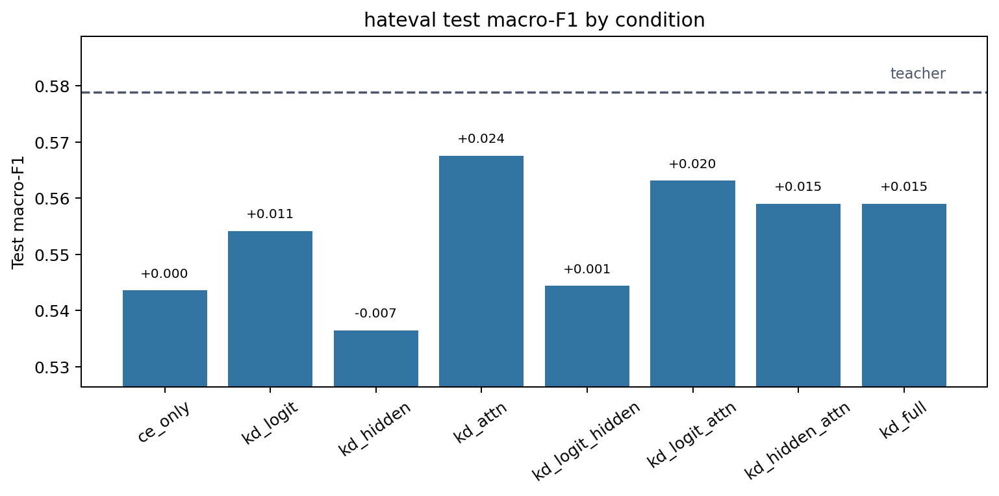
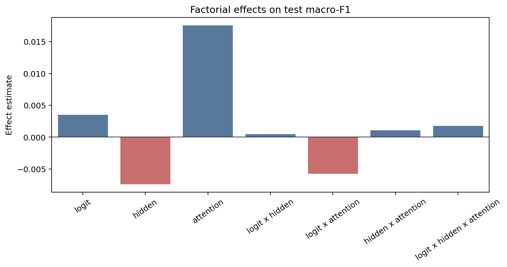
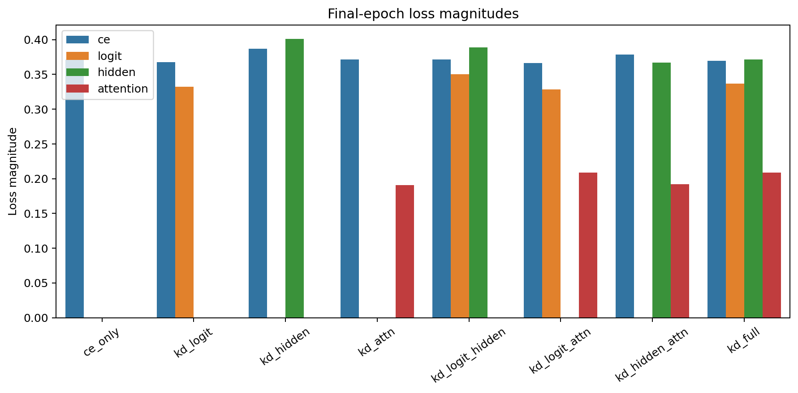
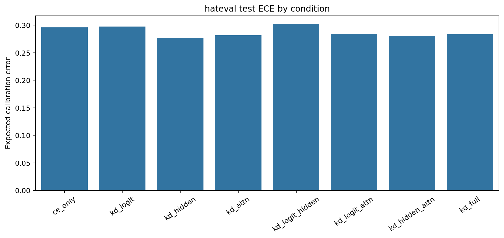

# Factorial Analysis Report

Dataset: `hateval`

## Artifact Summary

- Teacher metadata: `results/metadata/hateval/teacher/run_metadata.json`
- Student metadata: `results/metadata/hateval/student/*/run_metadata.json`
- Report: `results/analysis/hateval/REPORT.md`
- Figures: `figures/`

## Validity Checklist

| Check | Status | Detail |
|---|:---:|---|
| all 8 conditions present and valid | PASS | all 8 condition metadata files are present and valid |
| epochs completed | PASS | all runs completed configured epochs or documented early-stop |
| finite metrics/losses | PASS | all required metrics and active losses are finite |
| teacher forward sane | PASS | top1_agreement is present and above random for every KD condition |
| metric ranges | PASS | F1/accuracy/agreement/ECE values are within [0, 1] |
| artifacts written | PASS | 4 PNG figures and 1 markdown report written |

## Key Results

- Teacher test macro-F1: `0.5788`.
- Best student: `kd_attn` with test macro-F1 `0.5676`.
- CE-only student test macro-F1: `0.5436`.
- Student macro-F1 spread across conditions: `0.0311`.
- Mean final attention-loss magnitude: `0.20009`.

The best student is `kd_attn` (test macro-F1 `0.5676`), but with a single seed the factorial effects
below should be read as pipeline diagnostics and descriptive statistics, not
resolved causal estimates.

## Student Ablation Table

Dataset: `hateval`

Source files:
`results/metadata/hateval/teacher/run_metadata.json` and
`results/metadata/hateval/student/*/run_metadata.json`

Primary metric: test macro-F1. `Delta` is test macro-F1 relative to `ce_only`.
Rows are ordered by test macro-F1 descending.
Bold marks the best value in each metric column: higher is better for F1,
accuracy, and agreement; lower is better for ECE.

| Condition | Logit | Hidden | Attention | Test Macro-F1 | Delta | Test Acc. | Test ECE | Top-1 Agree |
|---|:---:|:---:|:---:|---:|---:|---:|---:|---:|
| `teacher` | N/A | N/A | N/A | **0.5788** | **+0.0353** | **0.5917** | 0.3034 | N/A |
| `kd_attn` |  |  | Y | 0.5676 | +0.0240 | 0.5775 | 0.2819 | 0.8851 |
| `kd_logit_attn` | Y |  | Y | 0.5631 | +0.0195 | 0.5744 | 0.2841 | 0.8882 |
| `kd_hidden_attn` |  | Y | Y | 0.5590 | +0.0155 | 0.5698 | 0.2809 | 0.8805 |
| `kd_full` | Y | Y | Y | 0.5590 | +0.0154 | 0.5718 | 0.2839 | **0.8943** |
| `kd_logit` | Y |  |  | 0.5542 | +0.0106 | 0.5674 | 0.2975 | 0.8917 |
| `kd_logit_hidden` | Y | Y |  | 0.5444 | +0.0008 | 0.5584 | 0.3021 | 0.8797 |
| `ce_only` |  |  |  | 0.5436 | +0.0000 | 0.5541 | 0.2961 | 0.8586 |
| `kd_hidden` |  | Y |  | 0.5365 | -0.0071 | 0.5505 | **0.2773** | 0.8508 |

Best student test macro-F1 is `kd_attn` at 0.5676, +0.0240 over `ce_only`.
The teacher reference is higher at 0.5788.

## Factorial Effects

Metric: `test_macro_f1`

Positive estimates mean the factor or interaction increases the metric under
standard +/-1 factorial coding. Magnitudes are informational for this
single-seed run.

| Effect | Kind | Estimate | Absolute |
|---|---:|---:|---:|
| `logit` | main | +0.00350 | 0.00350 |
| `hidden` | main | -0.00738 | 0.00738 |
| `attention` | main | +0.01753 | 0.01753 |
| `logit x hidden` | 2-way | +0.00044 | 0.00044 |
| `logit x attention` | 2-way | -0.00575 | 0.00575 |
| `hidden x attention` | 2-way | +0.00106 | 0.00106 |
| `logit x hidden x attention` | 3-way | +0.00178 | 0.00178 |

## Attention-Loss Caveat

Attention KD used post-softmax attention probabilities in this run. Its
final loss magnitude is near-inert compared with CE, logit, and hidden
losses, so the attention factor was only weakly applied. Fix this signal or
explicitly document the caveat before scaling the experiment.

## Figures

### Condition Bars

### Main Effects

### Loss Magnitudes

### Calibration

