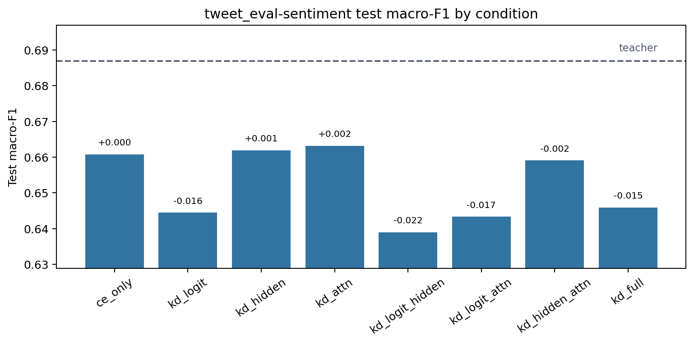
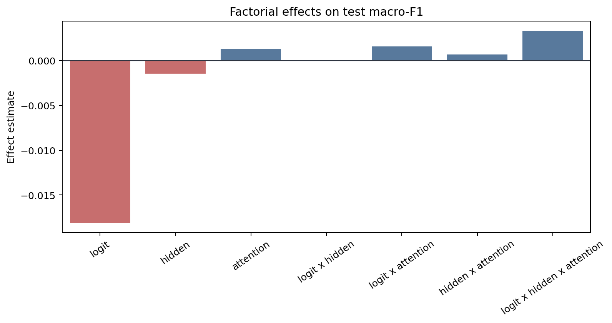
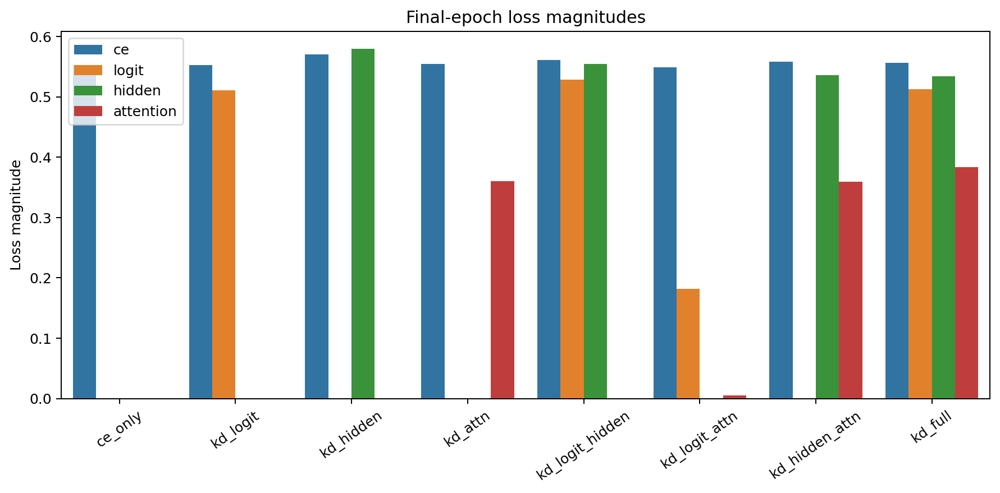
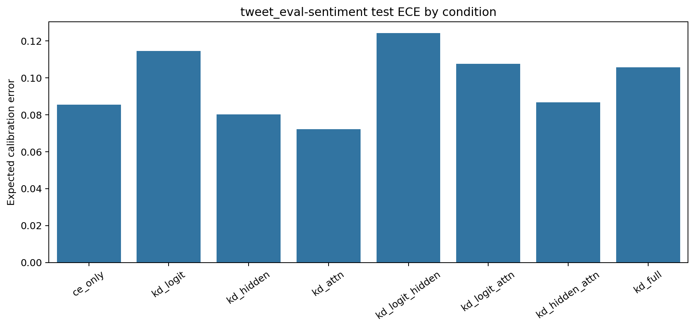

# Factorial Analysis Report

Dataset: `tweet_eval-sentiment`

## Artifact Summary

- Teacher metadata: `results/metadata/tweet_eval-sentiment/teacher/run_metadata.json`
- Student metadata: `results/metadata/tweet_eval-sentiment/student/*/run_metadata.json`
- Report: `results/analysis/tweet_eval-sentiment/REPORT.md`
- Figures: `figures/`

## Validity Checklist

| Check | Status | Detail |
|---|:---:|---|
| all 8 conditions present and valid | PASS | all 8 condition metadata files are present and valid |
| epochs completed | PASS | all runs completed configured epochs or documented early-stop |
| finite metrics/losses | PASS | all required metrics and active losses are finite |
| teacher forward sane | PASS | top1_agreement is present and above random for every KD condition |
| metric ranges | PASS | F1/accuracy/agreement/ECE values are within [0, 1] |
| artifacts written | PASS | 4 PNG figures and 1 markdown report written |

## Key Results

- Teacher test macro-F1: `0.6870`.
- Best student: `kd_attn` with test macro-F1 `0.6631`.
- CE-only student test macro-F1: `0.6607`.
- Student macro-F1 spread across conditions: `0.0242`.
- Mean final attention-loss magnitude: `0.27678`.

The best student is `kd_attn` (test macro-F1 `0.6631`), but with a single seed the factorial effects
below should be read as pipeline diagnostics and descriptive statistics, not
resolved causal estimates.

## Loss Weights

Global weights multiplying each active loss term:
`L_total = w_ce*L_CE + I_logit*w_logit*L_logit + I_hidden*w_hidden*L_hidden
+ I_attn*w_attn*L_attn`. Per-condition indicators `I` toggle terms on or off;
the weights themselves are identical across all conditions and datasets.

| Term | Weight |
|---|---:|
| CE | `1` |
| Logit | `3` |
| Hidden | `2.2` |
| Attention | `125` |

Logit KD temperature `T`: `1`.

## Student Ablation Table

Dataset: `tweet_eval-sentiment`

Source files:
`results/metadata/tweet_eval-sentiment/teacher/run_metadata.json` and
`results/metadata/tweet_eval-sentiment/student/*/run_metadata.json`

Primary metric: test macro-F1. `Delta` is test macro-F1 relative to `ce_only`.
Rows are ordered by test macro-F1 descending.
Bold marks the best value in each metric column: higher is better for F1,
accuracy, and agreement; lower is better for ECE.

| Condition | Logit | Hidden | Attention | Test Macro-F1 | Delta | Test Acc. | Test ECE | Top-1 Agree |
|---|:---:|:---:|:---:|---:|---:|---:|---:|---:|
| `teacher` | N/A | N/A | N/A | **0.6870** | **+0.0262** | **0.6875** | 0.0919 | N/A |
| `kd_attn` |  |  | Y | 0.6631 | +0.0024 | 0.6619 | **0.0723** | **0.7962** |
| `kd_hidden` |  | Y |  | 0.6619 | +0.0012 | 0.6618 | 0.0801 | 0.7844 |
| `ce_only` |  |  |  | 0.6607 | +0.0000 | 0.6594 | 0.0855 | 0.7866 |
| `kd_hidden_attn` |  | Y | Y | 0.6591 | -0.0017 | 0.6579 | 0.0868 | 0.7924 |
| `kd_full` | Y | Y | Y | 0.6459 | -0.0149 | 0.6446 | 0.1057 | 0.7860 |
| `kd_logit` | Y |  |  | 0.6444 | -0.0163 | 0.6431 | 0.1147 | 0.7782 |
| `kd_logit_attn` | Y |  | Y | 0.6433 | -0.0174 | 0.6419 | 0.1077 | 0.7773 |
| `kd_logit_hidden` | Y | Y |  | 0.6389 | -0.0218 | 0.6377 | 0.1242 | 0.7709 |

Best student test macro-F1 is `kd_attn` at 0.6631, +0.0024 over `ce_only`.
The teacher reference is higher at 0.6870.

## Factorial Effects

Metric: `test_macro_f1`

Positive estimates mean the factor or interaction increases the metric under
standard +/-1 factorial coding. Magnitudes are informational for this
single-seed run.

| Effect | Kind | Estimate | Absolute |
|---|---:|---:|---:|
| `logit` | main | -0.01809 | 0.01809 |
| `hidden` | main | -0.00145 | 0.00145 |
| `attention` | main | +0.00133 | 0.00133 |
| `logit x hidden` | 2-way | -0.00003 | 0.00003 |
| `logit x attention` | 2-way | +0.00157 | 0.00157 |
| `hidden x attention` | 2-way | +0.00071 | 0.00071 |
| `logit x hidden x attention` | 3-way | +0.00333 | 0.00333 |

## Attention-Loss Caveat

Attention KD used post-softmax attention probabilities in this run. Its
final loss magnitude is near-inert compared with CE, logit, and hidden
losses, so the attention factor was only weakly applied. Fix this signal or
explicitly document the caveat before scaling the experiment.

## Figures

### Condition Bars

### Main Effects

### Loss Magnitudes

### Calibration

